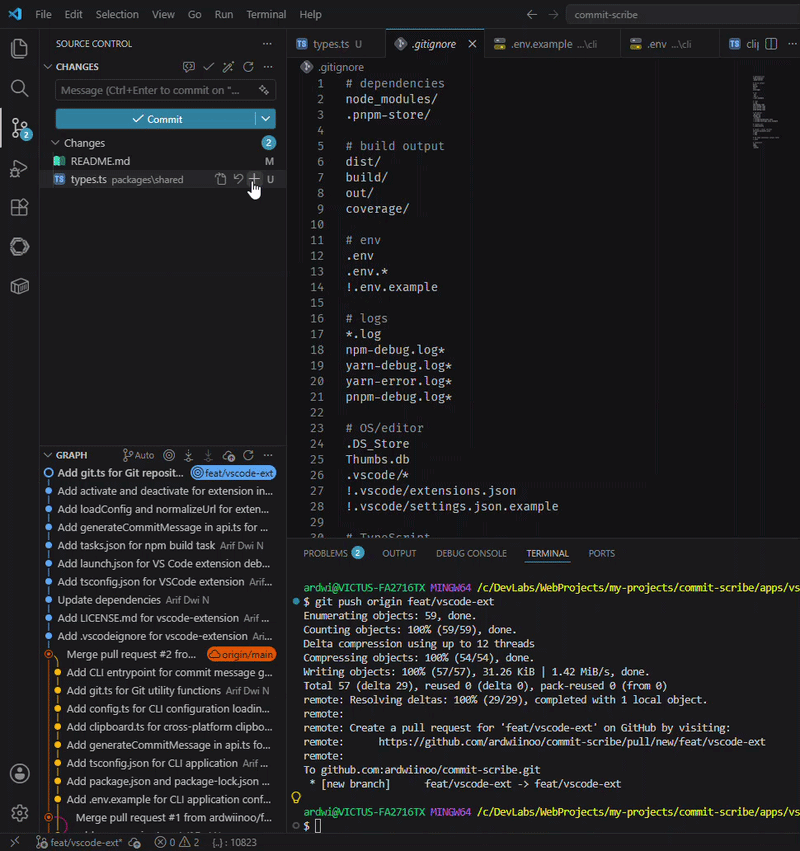

# Commit Scribe

> AI-powered commit message generator — right inside VS Code's Source Control panel.

Commit Scribe analyzes your staged Git diff and instantly generates a clear, conventional commit message using Vertex AI. No more staring at the blank commit input box.

---

## License

[MIT](./LICENSE) © [ardwiinoo](https://github.com/ardwiinoo)